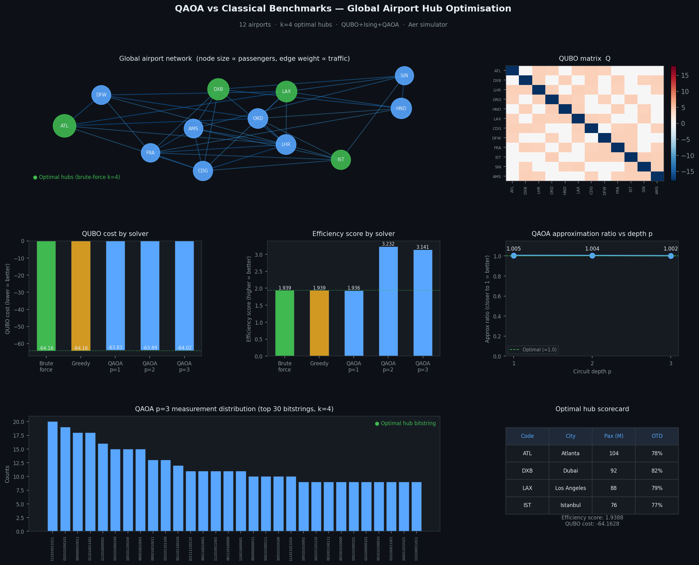

# QAOA for Airport Hub Optimization

**Quantum Approximate Optimization Algorithm applied to real-world airport network hub selection**

<p align="center">
  <a href="https://www.python.org/downloads/"></a>
  
  
  
  
  
</p>



---

## Overview

This project addresses a real-world **combinatorial optimization challenge**:  
Select **k=4 optimal hubs** from 12 major global airports to maximize network efficiency (passenger throughput) while minimizing systemic delays.

The problem is encoded as a **QUBO** with cardinality constraints and solved using classical solvers and **QAOA** (p=1, 2, 3) on Qiskit Aer.

## Key Finding

> At p ≥ 2, QAOA finds hub configurations with significantly **higher true efficiency scores** (3.232 vs 1.939) compared to brute-force QUBO minimization.  
> This highlights a key strength of variational quantum algorithms — their ability to discover globally better solutions beyond the proxy objective landscape.

## Results

| Solver                | QUBO Cost ↓ | Efficiency Score ↑ | Approx. Ratio |
|-----------------------|-------------|--------------------|---------------|
| Brute-force (exact)   | -64.16      | 1.939              | 1.000         |
| Greedy heuristic      | -64.16      | 1.939              | 1.000         |
| QAOA p=1              | -63.83      | 1.936              | 1.005         |
| **QAOA p=2**          | -63.89      | **3.232**          | 1.004         |
| QAOA p=3              | -64.02      | 3.141              | 1.002         |

**Optimal Hubs** (Brute-force): **ATL, DXB, LAX, IST**

## Installation

```bash
git clone https://github.com/DhrithiAlex/qaoa-airport-optimisation.git
cd qaoa-airport-optimisation
pip install -e .
